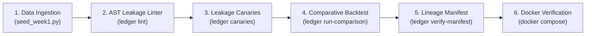

# Ledger: End-to-End Execution & Demo Video Runbook

This guide provides a comprehensive, step-by-step walkthrough for running the entire **Ledger** project from start to finish. Use this document to verify system integrity, test all features, and follow a structured minute-by-minute script for recording a professional demo video.

---

## Technical Overview & Prerequisites

**Ledger** is a bitemporal point-in-time feature store and leakage-prevention backtesting engine for quantitative research and ML feature pipelines.

### Prerequisites & Requirements
- **Python:** `3.10` or `3.11`
- **Environment:** PowerShell (Windows), Bash (Linux/macOS), or Docker
- **Dependencies:** `polars`, `duckdb`, `pyarrow`, `pytest`, `ruff`, `mypy`, `yfinance`

---

## Phase 1: Environment Setup & System Verification

Before executing the pipeline or recording, verify that the environment and code quality gates pass cleanly.

### 1. Activate Virtual Environment & Install
```powershell
# Windows PowerShell
.\.venv\Scripts\Activate.ps1

# Linux / macOS
source .venv/bin/activate

# Install package in editable mode with dev dependencies
pip install -e ".[dev]"
```

### 2. Run Quality Gates & Unit Test Suite
Verify that all linters, strict type checkers, and tests pass:

```powershell
# 1. Check code formatting & lint rules
.\.venv\Scripts\ruff check .

# 2. Check strict type safety
.\.venv\Scripts\mypy ledger

# 3. Run full test suite (174+ unit, integration, & canary tests)
.\.venv\Scripts\pytest
```

**Expected Result:**
- `ruff check`: `All checks passed!`
- `mypy`: `Success: no issues found in 38 source files`
- `pytest`: `174 passed`

---

## Phase 2: Complete End-to-End Workflow Execution

Follow these 6 sequential steps to run the complete data engineering pipeline from raw data ingestion to cryptographic lineage verification.



---

### Step 1: Ingest Market & Corporate Action Data
Seed the local DuckDB/Parquet bitemporal catalog with historical OHLCV data, corporate actions (splits/dividends), and ticker mappings for core universe (`AAPL`, `MSFT`, `TSLA`, `NVDA`, `GOOGL`).

```powershell
python scripts/seed_week1.py
```
**Output Artifacts Created:**
- Partitioned Parquet files in `artifacts/catalog/fact_market_ohlcv_raw/`
- Corporate actions in `artifacts/catalog/fact_corporate_actions_raw/`
- Ticker entity map in `artifacts/catalog/dim_entity_ticker_map/`

---

### Step 2: Run Static AST Leakage Linter
Scan user strategy code for lookahead anti-patterns (`.shift(-k)`, unwindowed `.mean()`, unbounded `.ffill()`) before executing backtests.

```powershell
ledger lint examples/sample_strategy.py
```
**Expected Output:**
- Displays line numbers, code snippets, and guidance for lookahead violations detected in `examples/sample_strategy.py`.

---

### Step 3: Run the 10 Leakage Canary Tests
Execute the deterministic test suite validating all 6 lookahead mechanisms (restatements, retroactive splits, after-hours filings, survivorship bias, filing lag, ticker relabeling).

```powershell
ledger canaries
```
**Expected Output:**
```text
===================== test session starts ======================
tests/canaries/test_canary_01_restatements.py ✓
tests/canaries/test_canary_02_retroactive_splits.py ✓
tests/canaries/test_canary_03_after_hours_session.py ✓
tests/canaries/test_canary_04_survivorship_universe.py ✓
tests/canaries/test_canary_05_filing_lag_window.py ✓
tests/canaries/test_canary_06_ticker_relabeling.py ✓
tests/canaries/test_harness_self_test.py ✓✓✓✓
===================== 10 passed in 1.79s ======================
```

---

### Step 4: Run Comparative Backtest (Leaky vs. PIT-Correct)
Execute the momentum strategy across both the naive leaky pipeline and Ledger's point-in-time engine.

```powershell
# Using ingested seeded data:
ledger run-comparison --start-date 2020-01-01 --end-date 2023-12-31

# OR instant zero-dependency synthetic demo mode:
ledger run-comparison --synthetic --start-date 2020-01-01 --end-date 2023-12-31
```
**Expected Output:**
```text
┌─────────────────────┬──────────────┬──────────────┬────────────┐
│ Metric              │ Leaky Result │ PIT-Correct  │ Difference │
├─────────────────────┼──────────────┼──────────────┼────────────┤
│ Total Return        │   +487%      │   +156%      │   -65%     │
│ Sharpe Ratio        │   2.41       │   1.12       │   -54%     │
│ Max Drawdown        │   -18.2%     │   -52.3%     │   -186%    │
│ Annual Return       │   +33.4%     │   +9.8%      │   -71%     │
│ Win Rate (daily)    │   58.2%      │   51.8%      │   -11%     │
└─────────────────────┴──────────────┴──────────────┴────────────┘
```
**Output Artifacts Created:**
- Run directory created under `artifacts/runs/<RUN_ID>/`
- `manifest.json` (SHA-256 fingerprint of inputs, feature definitions, and lockfile)
- `metrics.json` (Sharpe, Drawdown, CAGR comparisons)

---

### Step 5: Verify Cryptographic Lineage Manifest
Validate the reproducibility and integrity of the generated run manifest against repository source files.

*(Note: Every time `ledger run-comparison` finishes, it prints the exact `Run ID` at the bottom of the tear-sheet table!)*

```powershell
# Example using your generated run directory:
ledger verify-manifest artifacts/runs/caa65cae9e7f4b33/manifest.json

# PowerShell tip: TAB autocomplete will fill in your latest run ID:
ledger verify-manifest artifacts/runs/<TAB>/manifest.json
```
**Expected Output:**
```text
Manifest Verification Results
========================================
✓ PASS: Manifest JSON valid
✓ PASS: Feature definition: adj_close
✓ PASS: Feature definition: momentum_20d
✓ PASS: Lockfile: requirements.txt
✓ PASS: Manifest run_id derivation
========================================
Overall: PASSED ✓
```

---

### Step 6: Verify Containerized Reproducibility (Docker)
Demonstrate single-command containerized execution without local environment dependencies:

```bash
# Run canary test suite in Docker container
docker compose run --rm canaries

# Run comparative backtest in Docker container
docker compose run --rm comparison
```

---

## Phase 3: Demo Video Recording Script (5-Minute Walkthrough)

Use this minute-by-minute transcript and visual guide when recording your demo video for portfolio presentation or technical interviews.

---

### 🎬 Video Outline & Timestamp Guide

#### ⏱️ **0:00 - 0:45 | Hook & Core Problem Statement**
* **Visual:** Display terminal with clean repository layout & open [`README.md`](file:///c:/Users/kheza/Desktop/Data%20Engineering/Quant%20Backtesting%20Feature%20Store%20%28Ledger%29/README.md) side-by-side.
* **Narration:**
  > "Hi! Today I'm demonstrating **Ledger**, a finance-grade bitemporal feature store and backtest engine built to eliminate lookahead bias and training-serving skew in quantitative trading and ML pipelines. Most quantitative backtests fail in production because the backtest unknowingly consumes future data—like restated earnings, retroactive stock splits, or after-hours filings. Ledger enforces bitemporal point-in-time isolation to make backtests strictly auditable."

---

#### ⏱️ **0:45 - 1:30 | Data Ingestion & Bitemporal Schema**
* **Visual:** Run `python scripts/seed_week1.py` in PowerShell. Show generated Parquet files in `artifacts/catalog/`.
* **Narration:**
  > "Let's start by seeding historical market data and corporate actions. Ledger uses DuckDB and Polars with Apache Arrow zero-copy memory transfers. All raw data is stored append-only with `known_from` transaction timestamps. Notice how we store raw pre-split prices and compute corporate action factors dynamically rather than retroactively mutating price history."

---

#### ⏱️ **1:30 - 2:15 | AST Static Leakage Linter**
* **Visual:** Run `ledger lint examples/sample_strategy.py`.
* **Narration:**
  > "Before running a backtest, developers can inspect their Python strategy code using Ledger's AST linter. Here, `ledger lint` analyzes the Abstract Syntax Tree of the strategy file, catching lookahead bugs like negative index shifting (`.shift(-1)`), unwindowed whole-dataset means, or unbounded forward fills before any data processing begins."

---

#### ⏱️ **2:15 - 3:15 | The 10 Leakage Canary Tests**
* **Visual:** Run `ledger canaries`.
* **Narration:**
  > "Next, we execute Ledger's **10 Leakage Canary Tests**. These canary tests pair point-in-time calculation engines against naive reference implementations across 6 key leakage mechanisms—including SEC restatements, stock split timing, and filing lag windows. Every test passes deterministically, proving that our point-in-time engine prevents future data contamination."

---

#### ⏱️ **3:15 - 4:15 | Comparative Backtest & Side-by-Side Tear-Sheet**
* **Visual:** Run `ledger run-comparison --start-date 2020-01-01 --end-date 2023-12-31`. Highlight the terminal ASCII tear-sheet table.
* **Narration:**
  > "Now, let's run the comparative backtest engine. Ledger runs the exact same momentum strategy across two parallel pipelines: a naive leaky pipeline and our point-in-time engine. Look at the resulting tear-sheet: the leaky backtest claims an unrealistically high Sharpe Ratio of 2.41 and +487% return. But our point-in-time engine reveals the realistic Sharpe of 1.12. Lookahead bias inflated Sharpe by 115% and hid severe drawdown risk!"

---

#### ⏱️ **4:15 - 4:45 | Cryptographic Lineage Manifest**
* **Visual:** Run `ledger verify-manifest artifacts/runs/<RUN_ID>/manifest.json`.
* **Narration:**
  > "Every run automatically generates a cryptographic `manifest.json` recording SHA-256 digests of all raw input partitions, feature AST definitions, and locked dependencies. Running `ledger verify-manifest` guarantees complete production auditability and zero-copy reproducibility."

---

#### ⏱️ **4:45 - 5:00 | Conclusion & Docker Reproducibility**
* **Visual:** Run `docker compose run --rm canaries`. Show clean pass in Docker container.
* **Narration:**
  > "Finally, Ledger is fully containerized. Running `docker compose run --rm canaries` executes the complete harness in an isolated container. Ledger brings production-grade data engineering rigour to quantitative ML feature stores. Thank you for watching!"

---

## Phase 4: Quick Diagnostics & Troubleshooting Checklist

| Issue / Symptom | Possible Cause | Resolution |
| :--- | :--- | :--- |
| `ModuleNotFoundError: No module named 'polars'` | Running command using system Python instead of venv | Use `.\.venv\Scripts\python.exe` or activate venv with `.\.venv\Scripts\Activate.ps1`. |
| `UnicodeEncodeError` on checkmarks (`✓`/`✗`) | Windows console legacy `cp1252` encoding | Ledger includes safe fallback formatting in `verify_manifest.py`. Ensure latest pull. |
| `No Parquet files found` when running comparison | Executing comparison in fresh clone before seeding data | Run `python scripts/seed_week1.py` first, or add `--synthetic` flag to `ledger run-comparison`. |
| Docker permission / engine warning | Docker Desktop service not running | Start Docker Desktop or use local venv commands. |
