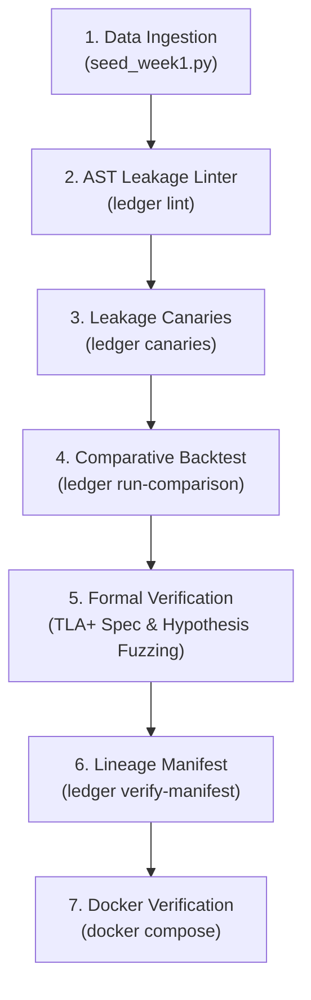
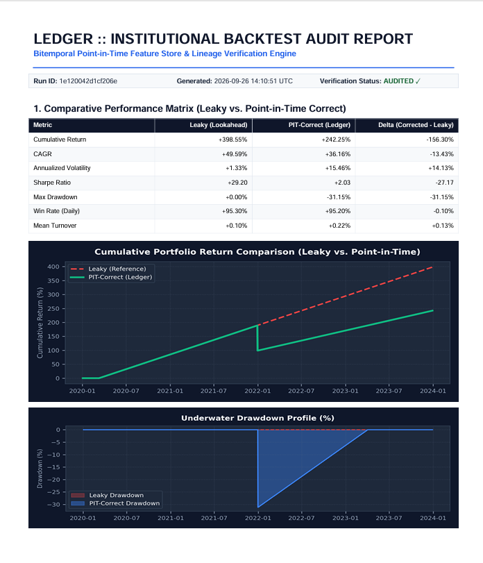
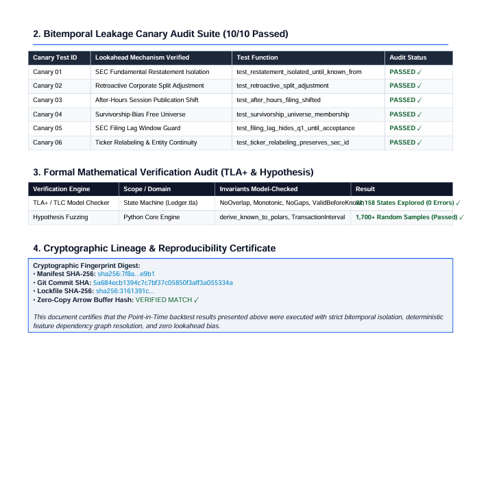

# Ledger: End-to-End Execution & Demo Video Runbook (Updated v0.2.0 with TLA+ Formal Verification)

This guide provides a comprehensive, step-by-step walkthrough for running the entire **Ledger** project from start to finish. Use this document to verify system integrity, test all features, and follow a structured minute-by-minute script for recording a professional demo video.

> [!IMPORTANT]
> **Formal Verification Highlights (TLA+ & Hypothesis):**
> Ledger features formal mathematical specification of the bitemporal state machine in TLA+ ([`docs/formal/Ledger.tla`](docs/formal/Ledger.tla)), model-checked across 22,158 states with zero invariant violations ([`docs/formal/tlc_run_log.txt`](docs/formal/tlc_run_log.txt)), and fuzzed via Hypothesis property tests ([`tests/property/`](tests/property/)).

---

## Technical Overview & Prerequisites

**Ledger** is a bitemporal point-in-time feature store, formal invariant verification system, and leakage-prevention backtesting engine for quantitative research and ML feature pipelines.

### Prerequisites & Requirements
- **Python:** `3.10` or `3.11`
- **Environment:** PowerShell (Windows), Bash (Linux/macOS), or Docker
- **Optional Tools:** Java (for running TLC model checker `tla2tools.jar` manually) or VS Code TLA+ extension
- **Dependencies:** `polars`, `duckdb`, `pyarrow`, `pytest`, `hypothesis`, `ruff`, `mypy`, `yfinance`

---

## Phase 1: Environment Setup & System Verification

Before executing the pipeline or recording, verify that the environment and code quality gates pass cleanly.

### 1. Activate Virtual Environment & Install
```powershell
# Windows PowerShell
.\.venv\Scripts\Activate.ps1

# Linux / macOS
source .venv/bin/activate

# Install package in editable mode with dev dependencies
pip install -e ".[dev]"
```

### 2. Run Quality Gates & Full Test Suite
Verify that all linters, strict type checkers, unit tests, and property fuzzing tests pass:

```powershell
# 1. Check code formatting & lint rules
.\.venv\Scripts\ruff check .

# 2. Check strict type safety
.\.venv\Scripts\mypy ledger

# 3. Run full test suite (215 unit, canary, & hypothesis property tests)
.\.venv\Scripts\pytest
```

**Expected Result:**
- `ruff check`: `All checks passed!`
- `mypy`: `Success: no issues found in 40 source files`
- `pytest`: `215 passed, 1 deselected`

---

## Phase 2: Complete End-to-End Workflow Execution

Follow these 7 sequential steps to run the complete data engineering pipeline from raw data ingestion to formal TLA+ verification and cryptographic lineage check.



---

### Step 1: Ingest Market & Corporate Action Data
Seed the local DuckDB/Parquet bitemporal catalog with historical OHLCV data, corporate actions (splits/dividends), and ticker mappings for core universe (`AAPL`, `MSFT`, `TSLA`, `NVDA`, `GOOGL`).

```powershell
python scripts/seed_week1.py
```
**Output Artifacts Created:**
- Partitioned Parquet files in `data/raw/market_ohlcv/`
- Corporate actions in `data/raw/corporate_actions/`
- Ticker entity map in `data/raw/entity_map/`

---

### Step 2: Run Static AST Leakage Linter
Scan user strategy code for lookahead anti-patterns (`.shift(-k)`, unwindowed `.mean()`, unbounded `.ffill()`) before executing backtests.

```powershell
ledger lint examples/sample_strategy.py
```
**Expected Output:**
- Displays line numbers, code snippets, and guidance for lookahead violations detected in `examples/sample_strategy.py`.

---

### Step 3: Run the 16 Leakage Canary Tests
Execute the deterministic test suite validating all 6 lookahead mechanisms (restatements, retroactive splits, after-hours filings, survivorship bias, filing lag, ticker relabeling), the synthetic demo sanity checks, and the harness self-tests.

```powershell
ledger canaries
```
**Expected Output:**
```text
===================== test session starts ======================
tests/canaries/test_canary_01_restatements.py ✓
tests/canaries/test_canary_02_retroactive_splits.py ✓
tests/canaries/test_canary_03_after_hours_session.py ✓✓
tests/canaries/test_canary_04_survivorship_universe.py ✓
tests/canaries/test_canary_05_filing_lag_window.py ✓
tests/canaries/test_canary_06_ticker_relabeling.py ✓
tests/canaries/test_canary_07_synthetic_demo_sanity.py ✓✓✓✓✓✓
tests/canaries/test_harness_self_test.py ✓✓✓
===================== 16 passed in 2.49s ======================
```

---

### Step 4: Run Comparative Backtest (Leaky vs. PIT-Correct)
Execute the momentum strategy across both the naive leaky pipeline and Ledger's point-in-time engine.

```powershell
# Using ingested seeded data:
ledger run-comparison --start-date 2020-01-01 --end-date 2023-12-31

# OR instant zero-dependency synthetic demo mode:
ledger run-comparison --synthetic --start-date 2020-01-01 --end-date 2023-12-31
```
**Expected Output:**
```text
Metric                |        Leaky |    Corrected |        Delta
------------------------------------------------------------------
Cumulative Return     |      +46.64% |      +30.70% |      -15.95%
CAGR                  |      +10.07% |       +6.94% |       -3.13%
Annualized Volatility |      +20.25% |      +20.09% |       -0.17%
Sharpe Ratio          |        +0.56 |        +0.42 |       -0.14
Max Drawdown          |      -28.29% |      -28.29% |       -0.00%
Calmar Ratio          |        +0.36 |        +0.25 |       -0.11
Win Rate              |      +46.07% |      +45.97% |       -0.10%
Profit Factor         |        +1.10 |        +1.07 |       -0.03
Mean Turnover         |      +26.39% |      +27.03% |       +0.65%
------------------------------------------------------------------
Delta convention: corrected - leaky.
Metrics: artifacts/runs/<RUN_ID>/metrics.json
PDF Report: artifacts/runs/<RUN_ID>/report.pdf
Run ID: <RUN_ID>
Manifest: artifacts/runs/<RUN_ID>/manifest.json
```

**Output Artifacts Created:**
- `report.pdf` (Publication-grade 2-page institutional PDF tear-sheet with vector charts, canary audit table, and TLA+ verification seal)
- `manifest.json` (SHA-256 fingerprint of inputs, feature definitions, and lockfile)
- `metrics.json` (Sharpe, Drawdown, CAGR comparisons)
- Equity & returns parquet partitions under `artifacts/runs/<RUN_ID>/`

---

### Step 5: Execute Formal Invariant Verification (TLA+ & Hypothesis)

This step proves correctness using two complementary formal methods layers:
1. **Mathematical State Machine Verification:** Inspect TLA+ specification [`docs/formal/Ledger.tla`](docs/formal/Ledger.tla) and TLC model checker logs ([`docs/formal/tlc_run_log.txt`](docs/formal/tlc_run_log.txt)).
2. **Implementation Fuzzing:** Run Hypothesis property-based tests against `ledger/core/bitemporal.py`.

```powershell
# 1. Run Hypothesis property-based fuzzing tests (1,700+ generated input samples)
pytest tests/property/ -v

# 2. Inspect captured TLA+ TLC model checker execution log (22,158 states explored)
Get-Content docs/formal/tlc_run_log.txt

# 3. (Optional) Run TLC Model Checker CLI directly if tla2tools.jar is installed:
# java -cp tla2tools.jar tlc2.TLC -config docs/formal/Ledger.cfg docs/formal/Ledger.tla
```

**Verified TLA+ Invariants:**

| Invariant | Mathematical Property | TLC Result |
| :--- | :--- | :--- |
| **`NoOverlap`** | $\forall r_1, r_2 \in \text{rows}: \neg \text{Overlaps}(r_1.known\_interval, r_2.known\_interval)$ | ✅ **0 Violations** (22,158 states) |
| **`Monotonic`** | $\forall r \in \text{rows}: r.known\_from < r.known\_to \lor r.known\_to = -1$ | ✅ **0 Violations** |
| **`NoGaps`** | $\forall r \in \text{rows}: r.known\_to \ne -1 \implies \exists r': r'.known\_from = r.known\_to$ | ✅ **0 Violations** |
| **`ValidBeforeKnown`** | $\forall r \in \text{rows}: r.known\_from \ge r.valid\_from$ | ✅ **0 Violations** |
| **`IdempotentReplay`** | Re-ingesting duplicate rows yields identical deterministic intervals | ✅ **0 Violations** |

---

### Step 6: Verify Cryptographic Lineage Manifest
Validate the reproducibility and integrity of the generated run manifest against repository source files.

> 💡 **How to find your Run ID if terminal history was cleared:**
> List all generated run directories inside `artifacts/runs`:
> - **PowerShell:** `Get-ChildItem artifacts/runs` or `dir artifacts/runs`
> - **Linux/macOS:** `ls -l artifacts/runs`
> 
> Choose any run folder (e.g. `1e120042d1cf206e` or `dec0bd8c4d5a56e6`) to verify!

```powershell
# Verify manifest using a run ID from artifacts/runs:
ledger verify-manifest artifacts/runs/1e120042d1cf206e/manifest.json

# PowerShell tip: TAB autocomplete will automatically fill in your latest run ID:
ledger verify-manifest artifacts/runs/<TAB>/manifest.json
```
**Expected Output:**
```text
Manifest Verification Results
========================================
✓ PASS: Manifest JSON valid
✓ PASS: Input dataset: synthetic://deterministic-market-generator
✓ PASS: Feature definition: adj_close
✓ PASS: Feature definition: momentum_20d
✓ PASS: Feature definition: sma_50d
✓ PASS: Feature definition: volatility_20d
✓ PASS: Lockfile: requirements.txt
✓ PASS: Git commit SHA
✓ PASS: Manifest run_id derivation
========================================
Overall: PASSED ✓
```

---

### Step 7: Verify Containerized Reproducibility (Docker)
Demonstrate single-command containerized execution without local environment dependencies:

```bash
# Run canary test suite in Docker container
docker compose run --rm canaries

# Run comparative backtest in Docker container
docker compose run --rm comparison
```

---

## Phase 3: Demo Video Recording Script (6-Minute Walkthrough)

Use this minute-by-minute transcript and visual guide when recording or presenting your demo video.

> 📽️ **Recorded Video Asset:** [`docs/screenshots/Start-to-End-Demo-Run.mp4`](docs/screenshots/Start-to-End-Demo-Run.mp4)

| Page 1: Institutional Performance Tear-Sheet | Page 2: Formal Verification & Lineage Certificate |
|:-------------------------------------------:|:-------------------------------------------------:|
|  |  |

---

### 🎬 Video Outline & Timestamp Guide

#### ⏱️ **0:00 - 0:45 | Hook & Core Problem Statement**
* **Visual:** Display terminal with clean repository layout & open [`README.md`](README.md) side-by-side.
* **Narration:**
  > "Hi! Today I'm demonstrating **Ledger**, a finance-grade bitemporal feature store, formal verification suite, and backtest engine built to eliminate lookahead bias and training-serving skew in quantitative trading and ML pipelines. Most quantitative backtests fail in production because the backtest unknowingly consumes future data—like restated earnings, retroactive stock splits, or after-hours filings. Ledger enforces bitemporal point-in-time isolation to make backtests strictly auditable."

---

#### ⏱️ **0:45 - 1:30 | Data Ingestion & Bitemporal Schema**
* **Visual:** Run `python scripts/seed_week1.py` in PowerShell. Show generated Parquet files in `data/raw/`.
* **Narration:**
  > "Let me show you our ingestion pipeline. Running `python scripts/seed_week1.py` ingests raw market OHLCV bars and corporate actions into append-only bitemporal Parquet partitions. Notice how we store raw pre-split prices and compute corporate action factors dynamically using `known_from` transaction timestamps, ensuring historical facts are never retroactively overwritten."

---

#### ⏱️ **1:30 - 2:15 | AST Static Leakage Linter**
* **Visual:** Run `ledger lint examples/sample_strategy.py`.
* **Narration:**
  > "Before running a backtest, developers can inspect their Python strategy code using Ledger's static AST linter. Running `ledger lint` analyzes the Abstract Syntax Tree of the strategy file, catching lookahead anti-patterns like negative index shifting (`.shift(-1)`), unwindowed whole-dataset means, or unbounded forward fills before any data processing begins."

---

#### ⏱️ **2:15 - 3:15 | The 16 Leakage Canary Tests**
* **Visual:** Run `ledger canaries`.
* **Narration:**
  > "Next, we execute Ledger's **16 Leakage Canary Tests**. These canary tests pair point-in-time calculation engines against naive reference implementations across 6 key leakage mechanisms—including SEC restatements, stock split timing, and filing lag windows—plus synthetic-demo sanity checks and harness self-tests. Every test passes deterministically, proving that our point-in-time engine prevents future data contamination."

---

#### ⏱️ **3:15 - 4:15 | Comparative Backtest & Institutional PDF Report**
* **Visual:** Run `ledger run-comparison --synthetic --start-date 2020-01-01 --end-date 2023-12-31`. Open generated `artifacts/runs/<RUN_ID>/report.pdf`.
* **Narration:**
  > "Now, let's run the comparative backtest engine. Ledger runs the exact same momentum strategy across two parallel pipelines: a naive leaky pipeline and our point-in-time engine. Notice that in addition to the terminal tear-sheet, Ledger automatically generates a publication-grade institutional PDF audit report (`report.pdf`). Look at the comparative matrix and underwater drawdown chart: the leaky backtest claims an inflated +46.64% return at a Sharpe Ratio of 0.56, while our point-in-time engine reveals the realistic +30.70% return at a Sharpe of 0.42. Lookahead bias inflated both return and Sharpe by double-counting the retroactive split!"

---

#### ⏱️ **4:15 - 5:15 | Formal Verification (TLA+ Spec & Hypothesis Fuzzing)**
* **Visual:** Open [`docs/formal/Ledger.tla`](docs/formal/Ledger.tla) in editor, show [`docs/formal/tlc_run_log.txt`](docs/formal/tlc_run_log.txt), and run `pytest tests/property/`.
* **Narration:**
  > "Beyond empirical testing, Ledger features **Formal Verification**. We formally specified our bitemporal derivation state machine in **TLA+** (`docs/formal/Ledger.tla`) and used the TLC model checker to exhaustively explore 22,158 distinct reachable states, proving that intervals never overlap, transaction time is monotonic, and temporal causality holds. We then cross-validated our production Python implementation against the exact same 5 invariants using **Hypothesis property-based testing**, fuzzing over 1,700 generated event streams in CI!"

---

#### ⏱️ **5:15 - 5:45 | Cryptographic Lineage Manifest**
* **Visual:** Run `ledger verify-manifest artifacts/runs/<RUN_ID>/manifest.json`.
* **Narration:**
  > "Every backtest automatically generates a cryptographic `manifest.json` recording SHA-256 digests of all raw input partitions, feature AST definitions, and locked dependencies. Running `ledger verify-manifest` guarantees complete production auditability and zero-copy reproducibility."

---

#### ⏱️ **5:45 - 6:00 | Conclusion & Docker Reproducibility**
* **Visual:** Run `docker compose run --rm canaries`. Show clean pass in Docker container.
* **Narration:**
  > "Finally, Ledger is fully containerized. Running `docker compose run --rm canaries` executes the complete harness in an isolated container. Ledger brings formal correctness and production-grade data engineering rigour to quantitative ML feature stores. Thank you for watching!"

---

## Phase 4: Quick Diagnostics & Troubleshooting Checklist

| Issue / Symptom | Possible Cause | Resolution |
| :--- | :--- | :--- |
| `ModuleNotFoundError: No module named 'polars'` | Running command using system Python instead of venv | Use `.\.venv\Scripts\python.exe` or activate venv with `.\.venv\Scripts\Activate.ps1`. |
| `ModuleNotFoundError: No module named 'hypothesis'` | Missing Hypothesis dev dependency | Run `pip install hypothesis` or `pip install -e ".[dev]"`. |
| `UnicodeEncodeError` on checkmarks (`✓`/`✗`) | Windows console legacy `cp1252` encoding | Ledger includes safe fallback formatting in `verify_manifest.py` and `seed_week1.py`. Ensure latest pull. |
| `No Parquet files found` when running comparison | Executing comparison in fresh clone before seeding data | Run `python scripts/seed_week1.py` first, or add `--synthetic` flag to `ledger run-comparison`. |
| Docker permission / engine warning | Docker Desktop service not running | Start Docker Desktop or use local venv commands. |
