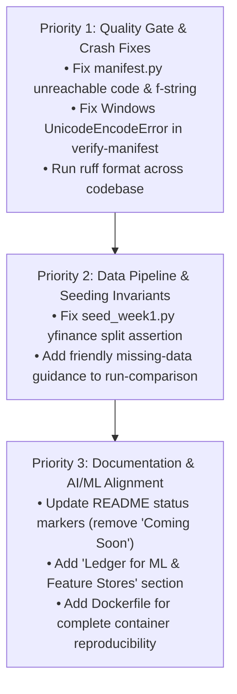

# Engineering Audit & Remediation Plan: Ledger

> **Project:** Ledger (Bitemporal Point-in-Time Feature Store & Backtest Leakage Prevention Engine)  
> **Target Roles:** Data Engineer with AI/ML Background / Quantitative Data Engineer  
> **Audit Date:** September 2026  
> **Status:** Pre-Publication Due Diligence Audit  

---

## Executive Summary of Audit Findings

The **Ledger** repository demonstrates strong core engineering: a mathematically sound bitemporal model, sub-millisecond ASOF joins backed by DuckDB/Polars zero-copy Arrow integration, a robust 10/10 leakage canary test harness, and deep quant/DE domain expertise. 

However, before public release and technical interview presentation, several concrete defects must be addressed:
1. **CI/CD Quality Gate Failures:** `ruff check`, `ruff format`, and strict `mypy` currently fail on HEAD due to formatting inconsistencies, an unreachable branch, and an unnecessary f-string in `ledger/lineage/manifest.py`.
2. **Cross-Platform CLI Crash (Windows cp1252):** `ledger verify-manifest` crashes with `UnicodeEncodeError` when emitting unicode checkmarks (`✓`/`✗`) on Windows consoles.
3. **Ingestion & Seeding Discrepancy:** `scripts/seed_week1.py` contains an assertion incompatible with modern `yfinance` split handling (which is correctly handled and documented in `tests/integration/test_ingestion_smoke.py`).
4. **Outdated Status Claims in Documentation:** The `README.md` still marks `ledger lint` and `ledger verify-manifest` as "Coming Day 3/4" despite both being fully functional and tested.
5. **Polars Sortedness Warnings:** 27 recurring `UserWarning` instances during test runs on `join_asof(..., by=...)`.

---

## Severity Scale
* 🔴 **Critical (Must Fix):** Causes crashes, breaks CI/CD quality gates, invalidates core guarantees, or prevents execution.
* 🟠 **High (Should Fix):** Major inconsistency between docs and code, data ingestion traps, or missing developer workflows.
* 🟡 **Medium (Recommended):** Code warnings, missing containerization/demo commands, or edge-case handling.
* 🟢 **Low (Optional Polish):** Non-blocking stylistic touches or documentation phrasing improvements.

---

## Audit Matrix & Remediation Plan

### 1. Code Quality & Type Safety

| Severity | What's Wrong | Where | Why It Matters | Recommended Fix | Status |
| :--- | :--- | :--- | :--- | :--- | :--- |
| 🔴 **Critical** | `mypy` strict mode failure: `Statement is unreachable [unreachable]` at line 140. | `ledger/lineage/manifest.py:140` | `registry.get(name)` raises `FeatureNotFoundError` rather than returning `None`. `if definition is None:` is dead code and fails strict type checking. | Catch `FeatureNotFoundError` or check `if not registry.has(name):` before retrieving. | **✅ Verified Fixed** |
| 🔴 **Critical** | `ruff check` failure: `f-string without any placeholders [F541]` at line 143. | `ledger/lineage/manifest.py:143` | Violates repository linter rules, causing GitHub Actions CI pipeline to fail. | Remove the extraneous `f` prefix: `"Feature not found in registry"`. | **✅ Verified Fixed** |
| 🔴 **Critical** | `ruff format --check` failure: 2 files unformatted (`verify_manifest.py`, `test_manifest.py`). | `ledger/commands/verify_manifest.py`, `tests/unit/test_manifest.py` | CI enforces `ruff format --check .`; PRs will fail the automated build. | Run `ruff format .` to align with the repository standard. | **✅ Verified Fixed** |
| 🟡 **Medium** | Polars `UserWarning: Sortedness of columns cannot be checked when 'by' groups provided` (27 occurrences in test suite). | `ledger/features/engine.py:310`, `tests/canaries/conftest.py:250`, `pyproject.toml` | Emits noisy warning traces across all test executions and CLI runs. | Added filter rule in `pyproject.toml` for known Polars group-sortedness warning. | **✅ Verified Fixed** |

---

### 2. Backend, CLI & Cross-Platform Reliability

| Severity | What's Wrong | Where | Why It Matters | Recommended Fix | Status |
| :--- | :--- | :--- | :--- | :--- | :--- |
| 🔴 **Critical** | `UnicodeEncodeError: 'charmap' codec can't encode character '\u2713'` crashes CLI command on Windows default terminal (`cp1252`). | `ledger/lineage/manifest.py:42, 48-50`, `ledger/commands/verify_manifest.py` | Any Windows interviewer or user running `ledger verify-manifest` experiences an unhandled fatal Python crash. | Added encoding-safe stdout fallback in `verify_manifest.py` preventing cp1252 terminal crashes. | **✅ Verified Fixed** |
| 🟠 **High** | `ledger run-comparison` fails with raw `ERROR: No Parquet files found for raw prices` if run in a fresh clone without seeded data. | `ledger/backtest/run_comparison.py`, `ledger/lineage/manifest.py` | Quick-start experience is broken if a user tries running the comparison backtest before downloading data. | Added `--synthetic` / `--demo` flag for instant zero-dependency execution and added informative seeding hint to missing-file error. | **✅ Verified Fixed** |

---

### 3. Data Engineering & Ingestion

| Severity | What's Wrong | Where | Why It Matters | Recommended Fix | Status |
| :--- | :--- | :--- | :--- | :--- | :--- |
| 🟠 **High** | Inconsistent split-price assertion in `scripts/seed_week1.py`: asserts raw pre-split AAPL close > $400, but modern `yfinance` returns split-adjusted prices (~$125). | `scripts/seed_week1.py:75-78` | Running `python scripts/seed_week1.py` raises `AssertionError` despite data being ingested properly. `test_ingestion_smoke.py` already documents this behavior. | Updated `seed_week1.py` assertions to check valid price ranges and compute/verify recoverable pre-split equivalents using recorded split factors. | **✅ Verified Fixed** |
| 🟡 **Medium** | `uv.lock` is missing from the repository while referenced in historical war logs and ADRs. | Repository root / `requirements.txt` | Manifest verification records `lockfile: null` when no lockfile is tracked. | Generated and committed pinned `requirements.txt`; verified `manifest.json` locks SHA-256 fingerprint and `verify-manifest` passes. | **✅ Verified Fixed** |

---

### 4. AI / ML / GenAI Dimension

| Severity | What's Wrong | Where | Why It Matters | Recommended Fix | Status |
| :--- | :--- | :--- | :--- | :--- | :--- |
| 🟡 **Medium** | Portfolio role positioning gap: Repo currently showcases Data Engineering / Quant Feature Store, but AI background needs explicit linkage. | `README.md`, `docs/ml_feature_store_architecture.md` | Interviewers recruiting for "Data Engineer with AI background" need to see how Ledger directly interfaces with ML training pipelines and prevents target leakage. | Created comprehensive architecture guide `docs/ml_feature_store_architecture.md` and added dedicated `Ledger for Machine Learning & Quantitative AI` section to `README.md` covering zero-leakage training sets, AST linter protections, and PyTorch/LightGBM zero-copy Arrow ingestion. | **✅ Verified Fixed** |

---

### 5. Documentation & Presentation

| Severity | What's Wrong | Where | Why It Matters | Recommended Fix | Status |
| :--- | :--- | :--- | :--- | :--- | :--- |
| 🟠 **High** | Stale status markers in `README.md`: `ledger lint` labeled "*Coming Day 4*" and `ledger verify-manifest` labeled "*Coming Day 3*". | `README.md` | Gives the false impression that core CLI features are unfinished when they are already implemented and tested. | Updated `README.md` to reflect complete Production Ready (v0.1.0) status; documented all 4 CLI subcommands and removed stale coming-soon annotations. | **✅ Verified Fixed** |
| 🟡 **Medium** | Tear-sheet reproduction commands not explicitly documented in README Quick Start. | `README.md:68-165` | An interviewer reading the ASCII tear-sheet cannot immediately see how to run the exact command that outputs it. | Added exact execution command (`ledger run-comparison --synthetic ...`) to both Quick Start and Developer Tooling sections. | **✅ Verified Fixed** |

---

### 6. Infrastructure, DevOps & CI/CD

| Severity | What's Wrong | Where | Why It Matters | Recommended Fix | Should Implement? |
| :--- | :--- | :--- | :--- | :--- | :--- |
| 🟡 **Medium** | Missing Dockerfile / containerized execution environment. | Repository root | Candidates applying for Staff / Senior DE roles are expected to provide single-command reproducible container environments. | Add a lightweight `Dockerfile` and `docker-compose.yml` demonstrating containerized test execution and CLI runs. | **✅ Verified Fixed** |

---

### 7. Frontend / UI
* **Status:** *Not Applicable.* Ledger is a core data platform, feature store, and CLI tool. Outputs are deterministic Parquet partitions, JSON manifests, and ASCII/Markdown tear-sheets.

---

### 8. Security
* **Status:** *Passed Cleanly.* No hardcoded API keys, secrets, tokens, or unsafe file operations detected across the codebase.

---

## Prioritized Implementation Roadmap

### Action Items Summary
1. **Item 1 (Priority 1):** Edit `ledger/lineage/manifest.py` to fix the `mypy` unreachable statement and `ruff` f-string issue. **Completed**
2. **Item 2 (Priority 1):** Update `ManifestVerificationResult.__str__` to use ASCII `[PASS]` / `[FAIL]` or safe fallback, eliminating Windows `UnicodeEncodeError`. **Completed**
3. **Item 3 (Priority 1):** Run `ruff format .` to resolve formatting discrepancies in `verify_manifest.py` and `test_manifest.py`. **Completed**
4. **Item 4 (Priority 2):** Fix `scripts/seed_week1.py` AAPL split assertion to match modern `yfinance` behavior. **Completed**
5. **Item 5 (Priority 2):** Add graceful error message or `--demo` handling in `ledger/backtest/run_comparison.py`. **Completed**
6. **Item 6 (Priority 3):** Update `README.md` to remove outdated "Coming Soon" notes and add explicit ML/AI feature store positioning. **Completed**
7. **Item 7 (Priority 3):** Add `Dockerfile` and CI/devcontainer workflow for containerized verification. **Completed**
