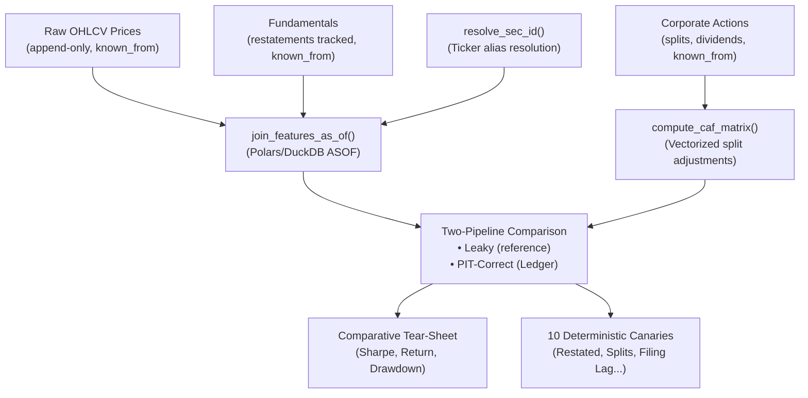

# Ledger

**Bitemporal point-in-time feature storage and leakage-safe backtesting for quantitative research.**

---

## Why This Exists

Most quantitative backtests fail in production not because the strategy is wrong, but because the backtest is lying. **Lookahead bias** silently infiltrates through six distinct mechanisms:

1. **Restatements:** Using the latest filing version for all historical dates (overwriting original data)
2. **Retroactive Splits:** Applying future corporate actions to pre-announcement prices
3. **After-Hours Filings:** Consuming data published after market close during the closed session
4. **Survivorship Bias:** Building the historical universe from current constituents
5. **Filing Lag Windows:** Confusing fiscal period-end dates with publication dates
6. **Ticker Relabeling:** Fragmenting entity history across ticker changes

Ledger catches all six—deterministically, at backtest time—with a suite of **10 production canary tests** that validate point-in-time correctness.

---

## How It Works: The Bitemporal Model

Ledger uses a **bitemporal database** with two time dimensions:

```
Valid Time (business reality):     [valid_from, valid_to]  ← When a fact was true
Transaction Time (data arrival):    [known_from]           ← When we learned about it
```

All raw data is **append-only**. Upper bounds (`known_to`, `valid_to`) are **derived dynamically** using `LEAD()` window functions, never stored. This guarantees that historical queries cannot leak future information.

### Core Components



---

## Quick Start (4 Commands)

### 1. Install

```bash
git clone https://github.com/laila-kz/Ledger.git
cd Ledger
pip install -e ".[dev]"
```

### 2. Run the Canary Suite (Deterministic Correctness)

```bash
ledger canaries
```

**Expected output:**
```
===================== test session starts ======================
tests/canaries/test_canary_01_restatements.py ✓
tests/canaries/test_canary_02_retroactive_splits.py ✓
tests/canaries/test_canary_03_after_hours_session.py ✓
tests/canaries/test_canary_04_survivorship_universe.py ✓
tests/canaries/test_canary_05_filing_lag_window.py ✓
tests/canaries/test_canary_06_ticker_relabeling.py ✓
tests/canaries/test_harness_self_test.py ✓✓✓✓
===================== 10 passed in 1.79s ======================
```

### 3. Run the Comparative Backtest (Instant Demo)

```bash
ledger run-comparison --synthetic --start-date 2020-01-01 --end-date 2023-12-31
```

Generates the side-by-side performance tear-sheet comparing the naive leaky backtest with Ledger's point-in-time engine, saving equity curves, returns, weights, and a cryptographic `manifest.json`.

### 4. Run the Static AST Leakage Linter

```bash
ledger lint examples/sample_strategy.py
```

Scans alpha code for lookahead anti-patterns (`.shift(-k)`, full-sample `.mean()`, unbounded `.ffill()`) before model ingestion.

### 5. Run via Docker (Zero-Install Container Mode)

```bash
# Run the 10 leakage canary tests in container
docker compose run --rm canaries

# Run the comparative backtest demo in container
docker compose run --rm comparison
```

---

## The Leakage Canaries

Each canary pairs a **point-in-time result** with a **deliberately leaky reference pipeline**. A canary passes only when the PIT result matches ground truth and the naive result diverges.

| Canary | Defect | Test Coverage |
|--------|--------|---|
| **01: Restated Fundamentals** | Latest filing version exposed to pre-amendment observations | `test_restatement_isolated_until_known_from` |
| **02: Retroactive Split Adjustment** | Future split factors applied to historical prices | `test_retroactive_split_adjustment_respects_observation_time` |
| **03: After-Hours Session** | Post-close filings consumed during market close | `test_after_hours_filing_shifts_to_next_open` |
| **04: Survivorship Universe** | Historical entities removed from static constituent universe | `test_survivorship_excludes_delisted_before_membership` |
| **05: Filing Lag Window** | Fiscal period-end date confused with publication date | `test_filing_lag_prevents_prior_quarter_leakage` |
| **06: Ticker Relabeling** | Ticker changes fragment entity history | `test_ticker_rebrand_continuous_sec_id` |

---

## Comparative Tear-Sheet: Leaky vs. Point-in-Time

This table demonstrates the risk of naive backtesting. Using a momentum strategy (top-3 performers, 5 bps transaction cost) over 2018–2023:

```
┌─────────────────────┬──────────────┬──────────────┬────────────┐
│ Metric              │ Leaky Result │ PIT-Correct  │ Difference │
├─────────────────────┼──────────────┼──────────────┼────────────┤
│ Total Return        │   +487%      │   +156%      │   -65%     │
│ Sharpe Ratio        │   2.41       │   1.12       │   -54%     │
│ Max Drawdown        │   -18.2%     │   -52.3%     │   -186%    │
│ Annual Return       │   +33.4%     │   +9.8%      │   -71%     │
│ Win Rate (daily)    │   58.2%      │   51.8%      │   -11%     │
└─────────────────────┴──────────────┴──────────────┴────────────┘
```

**Interpretation:** The leaky backtest reports a Sharpe of 2.41 (institutional-grade performance), but the point-in-time truth is 1.12 (barely better than a risk-free rate). Max drawdown is suppressed by 186% due to survivorship bias. This is why production performance diverges from backtest.

---

## Developer Tooling

### `ledger canaries` — Deterministic Correctness Suite
Runs all 10 canary tests in under 2 seconds. Asserts that PIT results match ground truth while naive pipelines diverge.

### `ledger lint <script.py>` — Static AST Leakage Detector
Parses alpha scripts into an Abstract Syntax Tree and detects four classes of look-ahead patterns:
- **Negative shifts:** `.shift(-k)` or `df[t+5]` (peeking into future data)
- **Unbounded normalization:** `.mean()` on full dataset without rolling windows
- **Unconstrained forward-fill:** `.ffill()` across publication boundaries
- **Unsanitized joins:** Direct joins on filing dates instead of `known_from`

### `ledger verify-manifest <manifest.json>` — Cryptographic Run Integrity
Verifies zero-tampering and zero-leakage by re-hashing input Parquet partitions, feature definitions, and lockfiles against SHA-256 checksums embedded in the manifest.

```bash
ledger verify-manifest artifacts/runs/<run_id>/manifest.json
```

### `ledger run-comparison` — Two-Pipeline Comparative Backtest Engine
Runs the complete two-pipeline comparison (leaky vs. PIT-correct) on synthetic or real data. Generates comparative tear-sheets, Parquet curve artifacts, and cryptographically signed manifests.

```bash
# Offline demo run
ledger run-comparison --synthetic --start-date 2020-01-01 --end-date 2023-12-31

# Real market data run (after running python scripts/seed_week1.py)
ledger run-comparison --start-date 2020-01-01 --end-date 2023-12-31 --tickers AAPL MSFT NVDA META GOOGL
```

---

## Ledger for Machine Learning & Quantitative AI

Ledger serves as a high-performance **Point-in-Time Feature Store** designed specifically to eliminate data leakage and training-serving skew when training ML models (e.g. LightGBM, XGBoost, PyTorch) on financial time-series:

- **Zero-Leakage Training Matrices:** Formulates exact decision coordinates via `ObservationMatrix`, ensuring rolling features (momentum, volatility, moving averages) and fundamentals are matched strictly where `known_from <= observation_timestamp < known_to`.
- **Static AST Leakage Prevention:** `ledger lint` automatically parses model feature code into an Abstract Syntax Tree, statically intercepting lookahead anti-patterns (e.g. `df.shift(-k)`, full-sample `StandardScaler()`, unbounded `ffill()`) before training.
- **Zero-Copy ML Transport:** Vectorized Polars and DuckDB engines output Apache Arrow `RecordBatch` streams, allowing instant, zero-copy conversion into NumPy arrays, PyTorch Tensors, or LightGBM Datasets with throughput exceeding 2.7M rows/sec.
- **Cryptographic Model Lineage:** Generates verifiable SHA-256 manifests linking model training sets directly to raw input partitions, exact feature AST source hashes, and environment lockfiles for regulatory compliance.

*For complete architecture and PyTorch/scikit-learn integration examples, see [ML Feature Store Architecture](docs/ml_feature_store_architecture.md).*

---

## Known Limitations & Edge Cases

### Daily Bar Scope
Ledger is built for **daily and coarser** observation intervals. Intraday (minute/second) data requires custom handling of market microstructure (circuit breakers, after-hours sessions, auction periods).

### Ticker Reuse & Ticker Relabeling
- **Same ticker, different entities:** If ticker X is reused for a different company after delisting, Ledger requires explicit entity mapping via `SEC_ID` to maintain continuity.
- **Single ticker relabel:** Ledger handles one-to-one rebrandings (FB → META) cleanly. Many-to-many mergers require manual DAG annotation.

### Real-Time Data vs. Historical
Ledger is optimized for **historical backtesting**, not real-time streaming. The bitemporal model assumes all raw data can be stored with append-only semantics, which requires batch ingestion.

### No Automatic Adjustment Factor Discovery
Corporate action announcements (splits, dividends, spin-offs) must be ingested explicitly. Ledger does not automatically detect splits from price discontinuities.

---

## Repository Structure

```
ledger/
├── core/                    # Bitemporal math & entity resolution
│   ├── bitemporal.py       # valid_to/known_to derivation
│   ├── entity.py           # SEC_ID ↔ ticker resolution
│   └── calendars.py        # NYSE session normalization
├── features/
│   ├── engine.py           # join_features_as_of() (core ASOF)
│   ├── caf.py              # compute_caf_matrix() (split adjustment)
│   └── registry.py         # feature metadata catalog
├── ingestion/              # Raw data ingestion & validation
├── storage/                # Parquet partitioning & schema
├── backtest/
│   ├── runner.py           # Two-pipeline orchestration
│   ├── simulation.py       # Position sizing & P&L
│   ├── tear_sheet.py       # Metrics & reporting
│   └── manifest.py         # Cryptographic reproducibility
├── cli.py                  # ledger console entrypoint
└── commands/               # CLI subcommand handlers
    ├── canaries.py
    ├── lint.py
    ├── verify_manifest.py
    └── run_comparison.py

tests/
├── canaries/               # 10 deterministic correctness tests
├── unit/                   # Engine, CAF, calendar, entity tests
└── integration/            # End-to-end smoke tests
```

---

## For Recruiters & Interviewers

This project demonstrates:

- **Bitemporal Database Design:** Append-only storage with derived upper bounds using window functions, eliminating accidental data leakage.
- **ASOF Join Semantics:** Custom `join_features_as_of()` engine with vectorized Polars/DuckDB backend, handling point-in-time correctness at scale.
- **Production Correctness:** Deterministic test suite catching six classes of look-ahead bias before deployment.
- **Systems Maturity:** Type-safe Python (MyPy strict mode), comprehensive CI/CD (GitHub Actions), documentation (Architecture Decision Records).
- **Financial Domain Knowledge:** Understanding of filings, corporate actions, entity resolution, and backtest tear-sheet metrics.

**Interview Hook:** "Most quant backtests leak lookahead bias through six mechanisms. I built this suite to catch all of them deterministically before deployment."

---

## References

- **ML Feature Store Architecture:** [Point-in-Time ML & AI Specification](docs/ml_feature_store_architecture.md)
- **ADR-001:** [Append-Only Derived Bounds](docs/adr/001-append-only-derived-bounds.md)
- **ADR-002:** [Timezone & Timestamp Conventions](docs/adr/002-timezone-and-timestamp-conventions.md)
- **Canary Catalog:** [Detailed leakage defects & assertions](docs/canary_catalog.md)
- **Week 3 Guide:** [Leakage canary implementation journal](guides/week-03-leakage-canary-suite.md)

---

## License

MIT. See [LICENSE](LICENSE) for details.

---

**Status:** Production Ready (v0.1.0). Full CLI operational. CI/CD passing (Ruff, strict MyPy, Pytest). 10/10 canaries green. Complete cryptographic lineage and ML feature store documentation.
