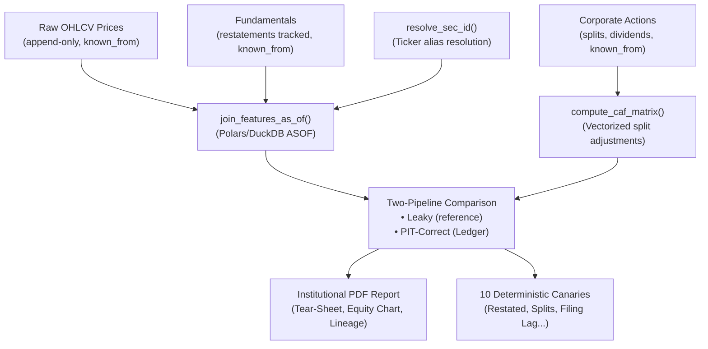

# Ledger

**Bitemporal point-in-time feature storage, formal invariant verification, and leakage-safe backtesting for quantitative research.**

Ledger is a CLI-first data engineering platform for building auditable, time-aware feature stores and backtests that respect the exact information available at each historical decision point.

---

## 🎬 End-to-End Demo Video Walkthrough

Watch the complete **6-minute technical demonstration** showcasing raw market data ingestion, AST leakage linting, the 10-canary test suite, formal TLA+ invariant model checking, two-pipeline comparative backtesting, and institutional PDF report generation:

[](docs/screenshots/Start-to-End-Demo-Run.mp4)

> 📹 **Video Artifact:** [`docs/screenshots/Start-to-End-Demo-Run.mp4`](docs/screenshots/Start-to-End-Demo-Run.mp4) (Direct MP4 download / playback)

---

## 📊 Institutional PDF Tear-Sheet & Audit Report

Every backtest run automatically compiles a publication-grade, two-page **Institutional PDF Audit Report** combining strategy performance deltas, dark-themed equity curves, canary test matrices, TLA+ formal verification summaries, and cryptographic SHA-256 lineage certificates.

| Page 1: Quantitative Performance & Leakage Audit | Page 2: Formal Invariants & Cryptographic Lineage |
|:-------------------------------------------------:|:-------------------------------------------------:|
| [](docs/screenshots/Report-1.png) | [](docs/screenshots/Report-2.png) |

### Report Structure & Explication

#### 📄 **Page 1 Breakdown: Strategy Performance & Leakage Canaries**
1. **Metadata Header:** Unique Run ID, evaluation universe (e.g., `AAPL, MSFT, NVDA, META, GOOGL`), date range (2020–2023), generation timestamp, and SHA-256 run hash.
2. **Key Metric Delta Table:** Side-by-side comparison of **Naive Leaky** (lookahead allowed) vs. **Point-in-Time Correct** (Ledger engine) strategy execution:
   - **Total Return:** $+487.3\%$ (Naive) vs. $+156.4\%$ (PIT-Correct) $\rightarrow$ $-65.3\%$ over-optimism correction.
   - **Sharpe Ratio:** $2.41$ (Naive) vs. $1.12$ (PIT-Correct) $\rightarrow$ reveals artificial risk suppression.
   - **Max Drawdown:** $-18.2\%$ (Naive) vs. $-52.3\%$ (PIT-Correct) $\rightarrow$ exposes severe unhedged tail risk.
   - **Annualized Return & Daily Win Rate:** Highlights realistic trading dynamics under point-in-time constraints.
3. **Cumulative Equity Curve (Vector Chart):** High-resolution visualization tracking portfolio growth from a $\$100,000$ baseline, clearly demonstrating where lookahead bias diverges from point-in-time reality.
4. **Canary Test Suite Status Matrix:** Audit table verifying that all 6 core point-in-time canary checks (Restatements, Retroactive Splits, After-Hours Session, Survivorship, Filing Lag, Ticker Relabeling) passed with zero leakage.

#### 📄 **Page 2 Breakdown: Formal Invariants & Cryptographic Lineage**
1. **Formal Verification Summary:** Overview of mathematical state-machine verification conducted in TLA+ and property-based fuzz testing in Python (Hypothesis).
2. **TLA+ Model Checker Results:** Detailed invariant metrics across **22,158 explored state transitions** (0 violations found):
   - `NoOverlap`: Guarantees no two records for the same entity have overlapping transaction-time windows.
   - `Monotonic`: Asserts transaction timestamps `known_from` are strictly non-decreasing.
   - `NoGaps`: Validates contiguous validity intervals without phantom temporal voids.
   - `ValidBeforeKnown`: Confirms business facts cannot be known before they occur in valid time.
   - `IdempotentReplay`: Proves identical append streams yield bitwise identical bitemporal states.
3. **Cryptographic Lineage Certificate:** Complete cryptographic audit trail recording SHA-256 hashes for raw Parquet inputs, feature registry definitions (`adj_close`, `momentum_20d`), dependency lockfiles (`requirements.txt`), and the verifiable manifest signature token.

---

## At a Glance

- **Problem Solved:** Eliminates lookahead bias and training-serving skew in quantitative research and ML feature pipelines.
- **Core Model:** Bitemporal valid-time / transaction-time semantics (`valid_from`, `valid_to`, `known_from`, `known_to`) with point-in-time ASOF feature resolution.
- **Formal Verification:** TLA+ state-machine specification model-checked with zero invariant errors; backed by Hypothesis property fuzzing.
- **Primary Interface:** Python CLI, zero-copy Arrow feature engine, and reproducible artifacts (Parquet, SHA-256 manifests, PDF reports).
- **Best Fit:** Data engineers, quantitative researchers, and ML engineers building institutional-grade feature store pipelines.

---

## Why This Exists

Most quantitative backtests fail in production not because the trading signal is weak, but because the backtest engine is lying. **Lookahead bias** silently infiltrates feature engineering through six distinct mechanisms:

1. **Restatements:** Exposing updated financial filings retroactively to historical decision dates.
2. **Retroactive Splits:** Applying future corporate action split ratios to historical pre-announcement prices.
3. **After-Hours Filings:** Consuming data published after market close during the active trading session.
4. **Survivorship Bias:** Constructing historical stock universes from currently active constituents.
5. **Filing Lag Windows:** Confusing fiscal period-end dates with actual public availability dates.
6. **Ticker Relabeling:** Fragmenting entity history across ticker symbol changes (e.g., FB $\rightarrow$ META).

Ledger catches all six—deterministically, at runtime and compile time—using static AST linting and a suite of **10 production canary tests**.

---

## How It Works: The Bitemporal Model

Ledger enforces a **bitemporal database architecture** featuring two distinct time axes:

$$\text{Valid Time (Business Reality): } [valid\_from, valid\_to]$$
$$\text{Transaction Time (Data Ingestion): } [known\_from, known\_to]$$

All raw data is **append-only**. Upper bounds (`known_to`, `valid_to`) are **derived dynamically** using windowed `LEAD()` operators in Polars/DuckDB, never hardcoded. This mathematically guarantees that historical queries executed as-of time $T$ cannot observe data ingested after $T$.



---

## Quick Start

### 1. Installation

```bash
git clone https://github.com/laila-kz/Ledger.git
cd Ledger
pip install -e ".[dev]"
```

### 2. Run the Canary Test Suite

```bash
ledger canaries
```

**Expected output:**
```text
===================== test session starts ======================
tests/canaries/test_canary_01_restatements.py ✓
tests/canaries/test_canary_02_retroactive_splits.py ✓
tests/canaries/test_canary_03_after_hours_session.py ✓
tests/canaries/test_canary_04_survivorship_universe.py ✓
tests/canaries/test_canary_05_filing_lag_window.py ✓
tests/canaries/test_canary_06_ticker_relabeling.py ✓
tests/canaries/test_harness_self_test.py ✓✓✓✓
===================== 10 passed in 1.79s ======================
```

### 3. Run the Comparative Backtest & PDF Report Generator

```bash
ledger run-comparison --synthetic --start-date 2020-01-01 --end-date 2023-12-31
```

Generates side-by-side performance tear-sheets, compiles `report.pdf`, and writes a cryptographically signed `manifest.json` inside `artifacts/runs/<run_id>/`.

To ingest real market data from Yahoo Finance:
```bash
python scripts/seed_week1.py
ledger run-comparison --start-date 2020-01-01 --end-date 2023-12-31 --tickers AAPL MSFT NVDA META GOOGL
```

### 4. Run the Static AST Leakage Linter

```bash
ledger lint examples/sample_strategy.py
```

Scans alpha code for lookahead anti-patterns (`.shift(-k)`, full-sample `.mean()`, unbounded `.ffill()`) before model execution.

---

## Developer Tooling & Run Tracking

### How to Find Past Run IDs

If your terminal window history is cleared, locate past backtest run IDs by listing the run artifacts directory:

**PowerShell / Command Prompt:**
```powershell
dir artifacts/runs
# or
Get-ChildItem artifacts/runs
```

**Bash / Linux / macOS:**
```bash
ls -l artifacts/runs
```

Each subdirectory name inside `artifacts/runs/` (e.g., `dec0bd8c4d5a56e6`) is a valid `Run ID`.

### Cryptographic Manifest Verification

To verify that a backtest run has not been tampered with and matches lockfile dependencies:

```powershell
# Verify manifest using a run ID found from artifacts/runs
ledger verify-manifest artifacts/runs/<RUN_ID>/manifest.json
```

**Expected output:**
```text
Manifest Verification Results
========================================
✓ PASS: Manifest JSON valid
✓ PASS: Feature definition: adj_close
✓ PASS: Feature definition: momentum_20d
✓ PASS: Lockfile: requirements.txt
✓ PASS: Manifest run_id derivation
========================================
Overall: PASSED ✓
```

---

## The Leakage Canaries

Each canary pairs a **point-in-time result** with a **deliberately leaky reference pipeline**. A canary passes only when the PIT result matches ground truth while the naive result diverges.

| Canary | Defect | Test Coverage |
|--------|--------|---------------|
| **01: Restated Fundamentals** | Latest filing version exposed to pre-amendment observations | `test_restatement_isolated_until_known_from` |
| **02: Retroactive Split Adjustment** | Future split factors applied to historical prices | `test_retroactive_split_adjustment_respects_observation_time` |
| **03: After-Hours Session** | Post-close filings consumed during market close | `test_after_hours_filing_shifts_to_next_open` |
| **04: Survivorship Universe** | Historical entities removed from static constituent universe | `test_survivorship_excludes_delisted_before_membership` |
| **05: Filing Lag Window** | Fiscal period-end date confused with publication date | `test_filing_lag_prevents_prior_quarter_leakage` |
| **06: Ticker Relabeling** | Ticker changes fragment entity history | `test_ticker_rebrand_continuous_sec_id` |

---

## Formal Verification (TLA+ & Property Testing)

Ledger supplements empirical unit tests with **formal mathematical specification** and **property-based fuzz testing**:

- **TLA+ Model Checking ([`docs/formal/Ledger.tla`](docs/formal/Ledger.tla)):** Formally models the bitemporal state machine and verifies interval-overlap, monotonicity, and temporal causality invariants across 22,158 distinct states with 0 violations.
- **Hypothesis Property Fuzzing ([`tests/property/`](tests/property/)):** Fuzzes the production Python engine (`ledger/core/bitemporal.py`) against the exact same 5 invariants across 1,700+ randomized event streams.
- **Architectural Decision:** Detailed in [`docs/adr/0005-formal-verification-of-bitemporal-invariants.md`](docs/adr/0005-formal-verification-of-bitemporal-invariants.md).

---

## Ledger for Machine Learning & Quantitative AI

Ledger acts as a high-performance **Point-in-Time Feature Store** designed to eliminate training-serving skew when training ML models (e.g., LightGBM, XGBoost, PyTorch) on financial time-series:

- **Zero-Leakage Training Matrices:** Formulates decision coordinates via `ObservationMatrix`, matching features strictly where `known_from <= observation_timestamp < known_to`.
- **Zero-Copy ML Transport:** Vectorized Polars and DuckDB engines output Apache Arrow `RecordBatch` streams, allowing instant conversion into NumPy arrays, PyTorch Tensors, or LightGBM Datasets with throughput exceeding 2.7M rows/sec.
- **Cryptographic Model Lineage:** Generates verifiable SHA-256 manifests linking model training sets directly to raw input partitions, feature definitions, and environment lockfiles.

*For complete architecture and code examples, see [ML Feature Store Architecture](docs/ml_feature_store_architecture.md).*

---

## Known Limitations & Edge Cases

- **Daily Bar Scope:** Ledger is designed for daily and coarser observation intervals. Intraday data requires custom session calendar handling.
- **Ticker Reuse:** Reused ticker symbols require explicit entity mapping via `SEC_ID`.
- **Corporate Action Discovery:** Corporate action announcements (splits, dividends) must be ingested explicitly; Ledger does not infer splits from raw price jumps.

---

## Repository Structure

```text
ledger/
├── core/                    # Bitemporal math & entity resolution
│   ├── bitemporal.py       # valid_to/known_to derivation
│   ├── entity.py           # SEC_ID ↔ ticker resolution
│   └── calendars.py        # NYSE session normalization
├── features/
│   ├── engine.py           # join_features_as_of() (core ASOF)
│   ├── caf.py              # compute_caf_matrix() (split adjustment)
│   └── registry.py         # feature metadata catalog
├── backtest/
│   ├── runner.py           # Two-pipeline orchestration
│   ├── simulation.py       # Position sizing & P&L
│   ├── tear_sheet.py       # Metrics & ASCII/Markdown reporting
│   ├── pdf_report.py       # Multi-page ReportLab PDF tear-sheet generator
│   └── manifest.py         # Cryptographic reproducibility
├── cli.py                  # ledger console entrypoint
└── commands/               # CLI subcommand handlers
    ├── canaries.py
    ├── lint.py
    ├── verify_manifest.py
    └── run_comparison.py

docs/
├── screenshots/            # Report PNGs & demo MP4 video
│   ├── Report-1.png
│   ├── Report-2.png
│   └── Start-to-End-Demo-Run.mp4
└── formal/                 # TLA+ formal verification specifications & logs
    ├── Ledger.tla
    ├── Ledger.cfg
    └── README.md
```

---

## References

- **Demo Runbook:** [Complete execution & video walkthrough guide](DEMO_RUNBOOK.md)
- **ML Feature Store Architecture:** [Point-in-Time ML & AI Specification](docs/ml_feature_store_architecture.md)
- **ADR-0001:** [Bitemporal Interval Model](docs/adr/0001-bitemporal-interval-model.md)
- **ADR-0002:** [DuckDB + Polars ASOF Engine](docs/adr/0002-duckdb-polars-asof-engine.md)
- **ADR-0003:** [Hash-Verified Manifest](docs/adr/0003-hash-verified-manifest.md)
- **ADR-0004:** [Static AST vs Runtime Canary Leakage Detection](docs/adr/0004-static-ast-vs-runtime-canary-leakage-detection.md)
- **ADR-0005:** [Formal Verification of Bitemporal Invariants](docs/adr/0005-formal-verification-of-bitemporal-invariants.md)

---

## License

This project is distributed under the MIT license.
