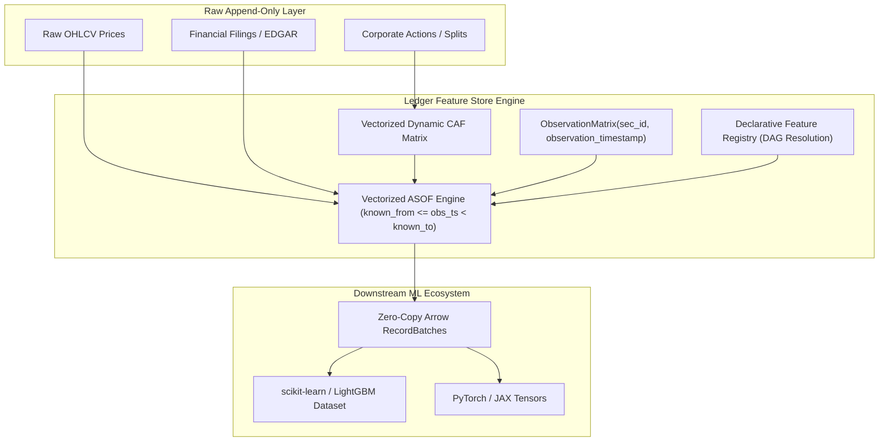

# Ledger for Machine Learning & Quantitative AI

> **Purpose:** Technical specification detailing how Ledger serves as a point-in-time feature store and data engineering platform for training and deploying machine learning (ML) models on temporal financial data without target leakage or training-serving skew.

Ledger is designed for practitioners who need production-quality feature pipelines for finance, not a dashboard-centric application layer. The emphasis is on feature correctness, auditability, and reproducibility at the data-engineering boundary where leakage problems actually originate.

---

## 1. The Machine Learning Problem on Time-Series Data

Machine learning models trained on financial time series (e.g., gradient boosted decision trees like LightGBM/XGBoost, temporal graph networks, LSTM/Transformers) fail in production primarily due to **data leakage in the feature generation layer**.

Unlike static tabular domains (e.g., image classification, NLP), temporal financial data presents unique failure modes:
1. **Target Leakage / Lookahead Bias:** Features computed over unsegmented time series incorporate future observations (e.g., full-sample normalization $\mu, \sigma$, negative index shifting `df.shift(-k)`).
2. **Restatement Leakage:** Models trained on historical quarters are fed restated financial statements that were not known to market participants on the observation date.
3. **Training-Serving Skew:** Offline training features computed via batch joins diverge from online features computed at inference time due to differing corporate action adjustments or timezone ambiguities.

Ledger solves these challenges by enforcing **strict point-in-time (PIT) bitemporal semantics** across the entire ML feature engineering lifecycle.

---

## 2. Point-in-Time Feature Extraction Architecture



### 2.1 The Observation Matrix Contract
In supervised ML, training data consists of pairs $(X_t, y_{t+h})$, where $X_t$ are features known strictly at or before decision time $t$, and $y_{t+h}$ is the future label (e.g., 5-day forward return).

Ledger formalizes this via `ObservationMatrix`:
```python
from datetime import datetime, timezone
import polars as pl
from ledger.features.engine import join_features_as_of

# Define exact ML decision coordinates (who and when)
obs_matrix = pl.DataFrame(
    {
        "sec_id": ["SEC_AAPL_001", "SEC_MSFT_001", "SEC_NVDA_001"],
        "observation_timestamp": [
            datetime(2023, 1, 15, 21, 15, tzinfo=timezone.utc),
            datetime(2023, 1, 15, 21, 15, tzinfo=timezone.utc),
            datetime(2023, 1, 15, 21, 15, tzinfo=timezone.utc),
        ],
    }
)

# Extract point-in-time features with mathematical leakage isolation
feature_matrix = join_features_as_of(
    entity_df=obs_matrix,
    feature_df=raw_features,
    feature_cols=["momentum_20d", "volatility_20d", "sma_50d"],
)
```

---

## 3. Five Guarantees for ML Practitioners

| ML Vulnerability | Naive Pipeline Flaw | Ledger Architectural Guarantee |
| :--- | :--- | :--- |
| **Global Scaling Leakage** | `StandardScaler().fit(X)` applied across the full historical dataset. | `ledger lint` rule `L002` rejects unwindowed aggregations; features are evaluated on causal rolling windows. |
| **Future Peeking in Signals** | `df['close'].shift(-1)` used in feature generation. | `ledger lint` rule `L001` statically detects negative shifts via AST analysis before model training. |
| **Unbounded Forward Fill** | `df.ffill()` leaking post-close earnings into earlier trading bars. | Bitemporal `[known_from, known_to)` bounds nullify expired or unannounced facts. |
| **Feature Version Drift** | Feature code modified without updating model training metadata. | Declarative Feature Registry computes deterministic SHA-256 source code digests embedded in run manifests. |
| **Zero-Copy ML Ingestion** | Inefficient serialization across Python/C++ boundaries. | Apache Arrow zero-copy memory transport allows instant conversion from Polars to NumPy, PyTorch, and LightGBM. |

---

## 4. Downstream ML Training Integration Example

```python
import polars as pl
import torch
from ledger.features.engine import compute_features_as_of
from ledger.features.registry import get_global_registry

# 1. Generate Point-in-Time Feature Matrix
registry = get_global_registry()
features_df = compute_features_as_of(
    observation_matrix=train_observations,
    raw_prices=raw_prices,
    feature_names=["momentum_20d", "volatility_20d", "sma_50d", "ema_50d"],
    splits=splits,
)

# 2. Zero-Copy Conversion to PyTorch Tensor
feature_cols = ["momentum_20d", "volatility_20d", "sma_50d", "ema_50d"]
arrow_table = features_df.select(feature_cols).to_arrow()
tensor_x = torch.from_numpy(arrow_table.to_pandas().to_numpy()).float()

# 3. Model Training (e.g. PyTorch / LightGBM)
# Zero chance of lookahead bias contaminating validation or out-of-sample metrics
```

---

## 5. Lineage & Cryptographic Model Auditability

Every ML dataset generated by Ledger can be accompanied by an immutable `manifest.json`:
* **Input Data Digest:** SHA-256 hash of all input Parquet partitions.
* **Feature Code Digest:** SHA-256 hash of the exact Python AST source for every feature definition.
* **Dependency Lock:** SHA-256 hash of `requirements.txt` / environment lockfile.

This ensures full regulatory compliance (e.g. SEC/FINRA auditability) and 100% reproducible ML experimentation.
